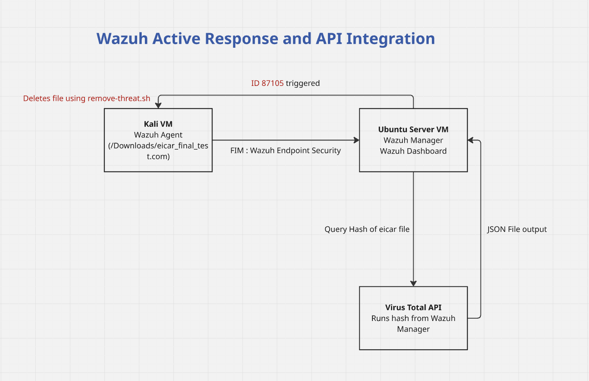
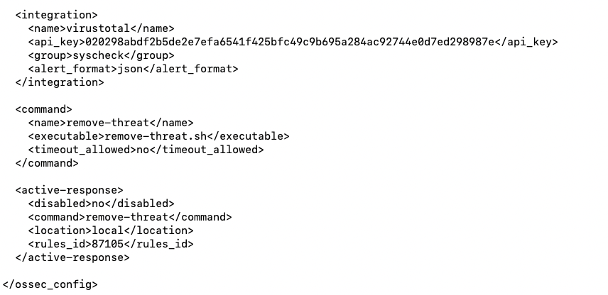
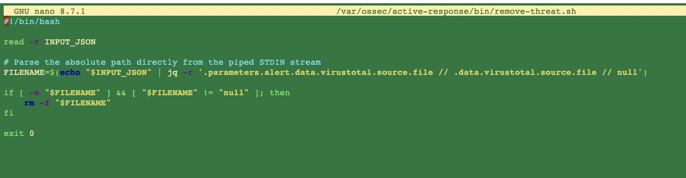
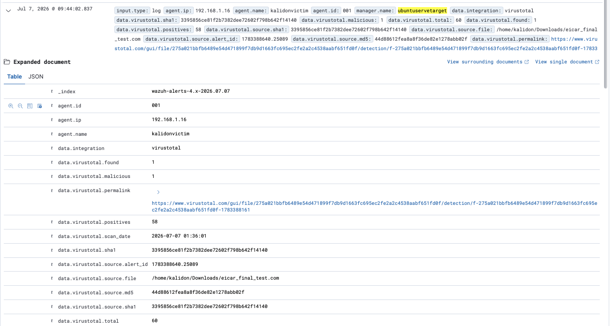
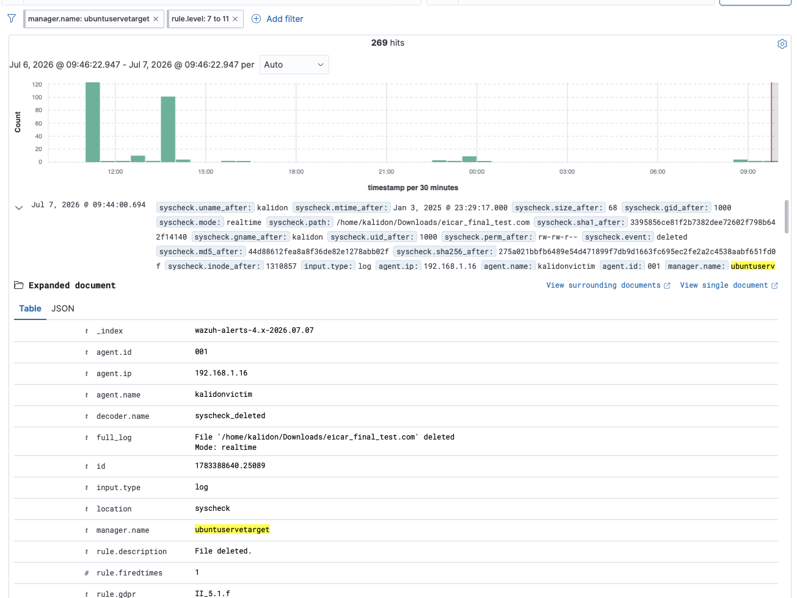

# Automated Malware Remediation with Wazuh and VirusTotal API
-------------------------------------------------------------

This project demonstrates an automated **Active Response** pipeline built using an All-in-One Wazuh deployment.
By activating FIM in Wazuh Endpoint Security we have enabled real-time monitoring of file creation, modification and deletion.
The system tracks real-time file creation on an endpoint, analyzes payloads via the VirusTotal API, and immediately responds to threats by executing a script.

------------------------------------

## 📐 Architecture Diagram

This workflow operates on a continuous feedback loop between the monitoring endpoint, the analysis manager, and external threat repositories:

------------------------------------

## 🛠️ Implementation & Configuration

### 1. Manager Configuration (`ossec.conf`)
Configure the following block in `/var/ossec/etc/ossec.conf` on your **Wazuh Manager** to provision the VirusTotal integration module and bind the automated triage execution flags:

------------------------------------
## 📜 Active Response Remediation Script

Deploy this processing logic on the system at **/var/ossec/active-response/bin/remove-threat.sh**. 
The script reads the raw JSON block via standard input stream (STDIN), uses **jq** to map out file system paths, and cleanly terminates the malicious payload.

------------------------------------

## ‼️ Virus Total Engine Result

When a test file matching the EICAR signature drop hits the target folder path (/home/kalidon/Downloads/eicar_final_test.com), Wazuh's File Integrity Monitoring calculates its cryptographic hash value. The manager passes this hash to the VirusTotal query endpoint, which logs a high-severity alert (alert level 12) and indicates 58 out of 60 positive signatures.

------------------------------------
## ⛔️ Automated Response Execution

Once the analysis engine validates that the payload crosses the threat threshold, it activates rule condition ID 87105. 
The active-response component kicks off the processing script locally to remove the threat. 
The subsequent internal scan loop immediately marks the file state as natively deleted, confirming remediation success.

------------------------------------

## 🎯 Conclusion

This setup demonstrates how integrating **Wazuh FIM** with the **VirusTotal API** creates an immediate, automated response loop to neutralize high-confidence threats. 

⚠️ **Production Note:** This aggressive orchestration should be deployed selectively. Running automated deletion "at full blast" across an entire enterprise carries risk, as legitimate files or false positives can occasionally mimic malicious signatures, leading to accidental data loss.
