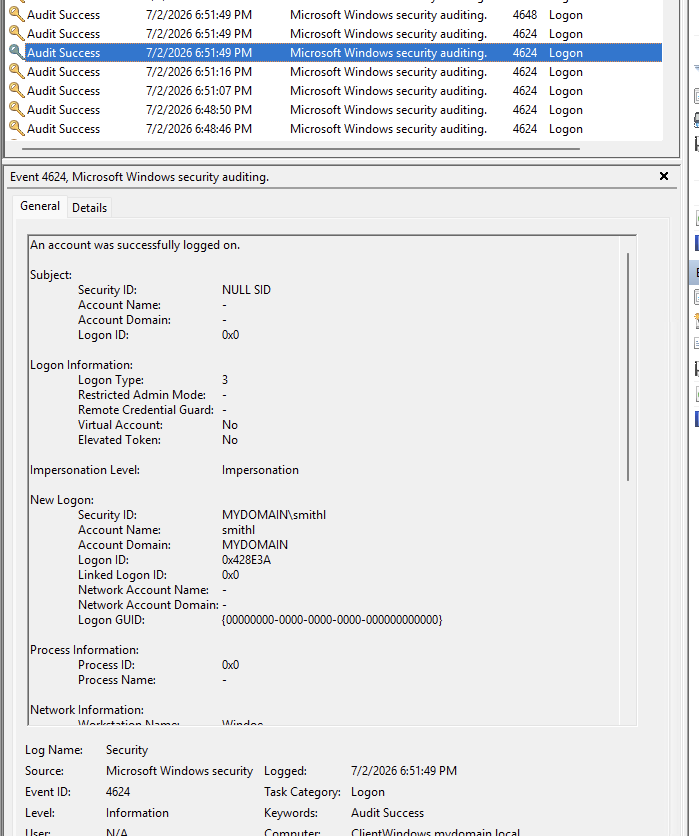
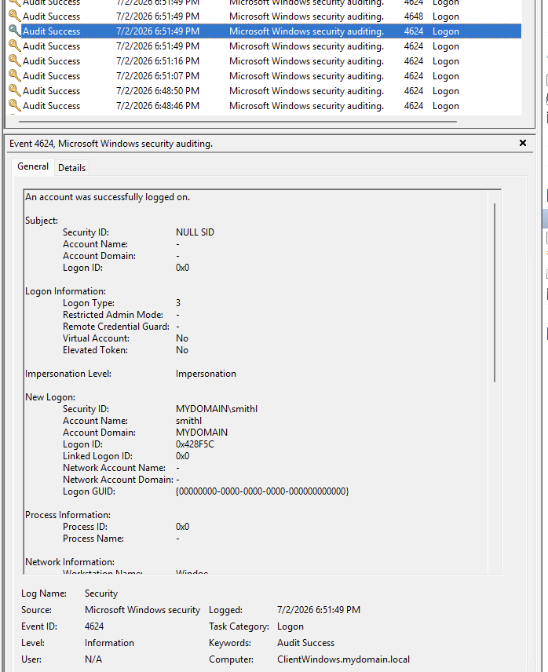
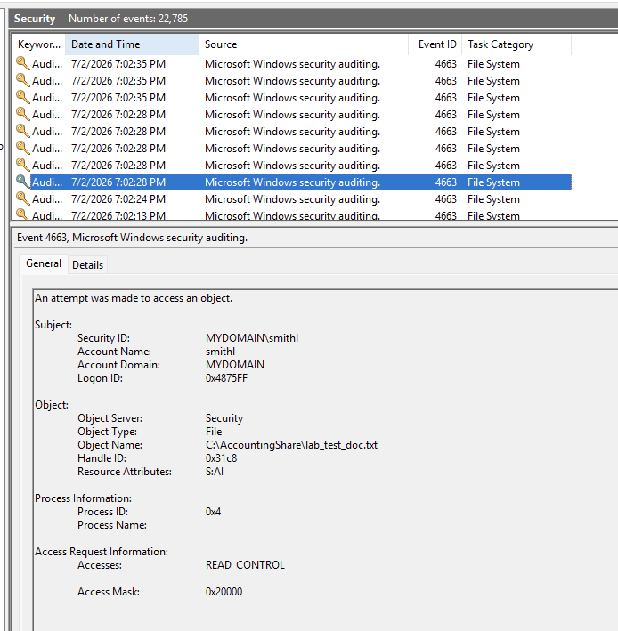

# Lab 1: Network Share Access via GUI (User: smithl)

## 1. Objective
To simulate an insider or compromised user (`MYDOMAIN\smithl`) navigating to and accessing a restricted departmental shared folder using the native Windows Graphical User Interface (GUI), and to analyze the resulting defensive telemetry.

---

## 2. Attack Scenario (GUI Navigation)
Instead of using the command line, the user accesses the shared network resource visually:
1. Opens **File Explorer** on the client workstation.
2. Navigates to the network path: `\\Windoe\AccountingShare`.
3. Double-clicks and opens the file: `lab_test_doc.txt`.

---

## 3. Defensive Telemetry & Evidence

### A. Network Authentication (Event ID 4624)
*   **Logon Type:** `3` (Network)
*   **Analysis:** The moment the user opens the folder via File Explorer, the client machine authenticates over the network to the Domain Controller using the SMB protocol. This generates **Event ID 4624 (Logon Type 3)**. Multiple logs appear at the exact same second due to Windows initializing separate background data channels.
*   **Evidence:**  
    
    

### B. File Access Auditing (Event ID 4663)
*   **Task Category:** File System
*   **Object Name:** `C:\AccountingShare\lab_test_doc.txt`
*   **Process ID:** `0x4` (System Kernel)
*   **Accesses:** `READ_CONTROL`
*   **Analysis:** When the user double-clicks the text file, an explicit **Event ID 4663** is triggered on the Domain Controller. The `Process ID 0x4` confirms that the Windows System Kernel handled the file read request directly on behalf of the inbound network connection.
*   **Evidence:**  
    
