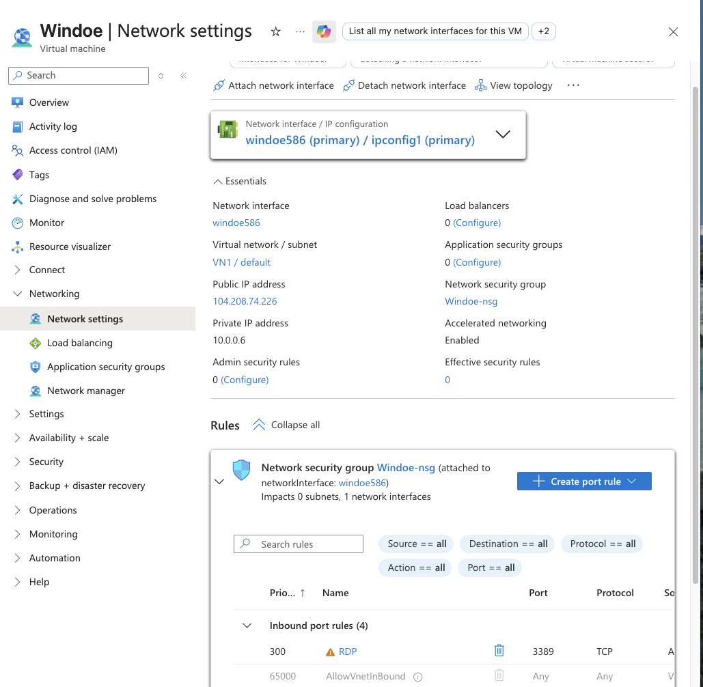
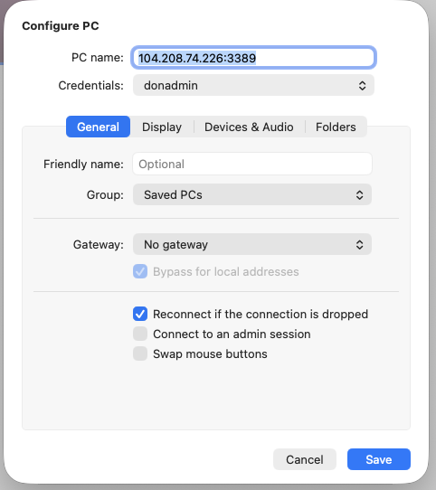
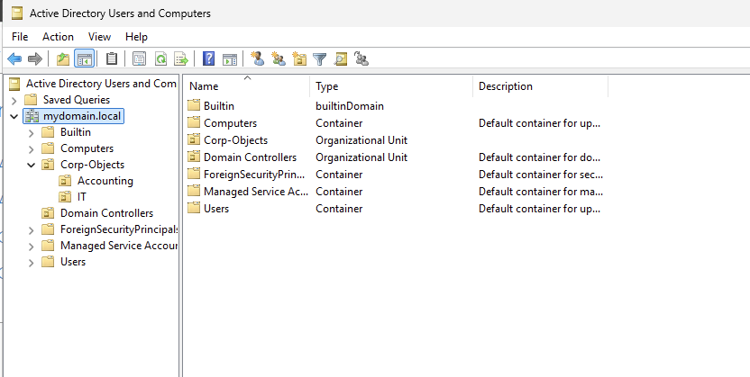
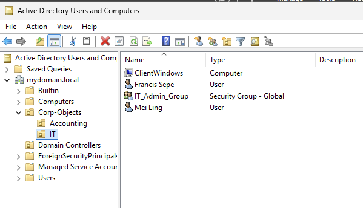
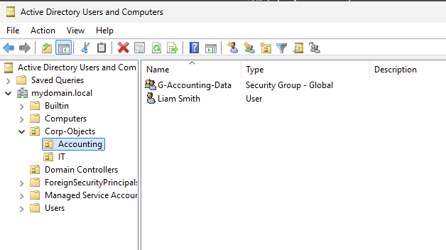
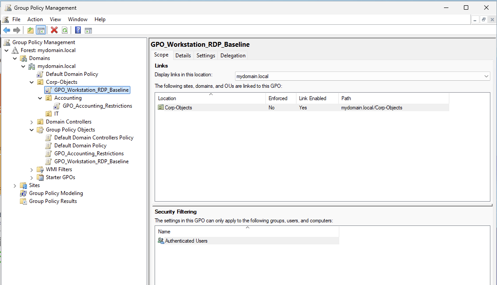

Phase 0: Infrastructure & Identity ArchitecturePhase 0: Infrastructure & Identity Architecture

## 1. Cloud Provisioning & Network Topology (Microsoft Azure)
The foundational infrastructure for this laboratory is hosted within Microsoft Azure, mimicking a modern hybrid-cloud enterprise deployment. 

* **Virtual Machine Context:** Provisioned a Windows Server instance (`Windoe`) utilizing a private address space of `10.0.0.0/24` with the specific static internal mapping of `10.0.0.6`.
* **Network Security Group (NSG) Controls:** * Deployed a dedicated NSG (`Windoe-nsg`) to govern ingress and egress traffic boundaries.
    * Configured Inbound Port Rule `300` to allow Remote Desktop Protocol (RDP) traffic over port `3389` exclusively to authorize administrative management sessions.
* **Management Connectivity:** Secure remote management is established from an external administrator console utilizing explicit administrative credentials (`donadmin`) targeted at the public interface.

### Cloud Infrastructure Verification
The screenshots below validate the live Azure networking topology, interface configurations, and management access profiles:

#### Azure Network Security Group & IP Configuration

#### Remote Desktop Management Profile

2. Active Directory Domain Services (AD DS) Initialization
The root identity architecture was initialized and promoted using native Windows management tools with the following structural parameters:

Deployment Operation: Created a brand-new Active Directory Forest.

Root Domain Name: MYDOMAIN.local

NetBIOS Name: MYDOMAIN

Forest & Domain Functional Levels: Set to the latest functional levels to enable modern security features and enhanced cryptographic controls.

Global Catalog (GC): Initialized on the root Domain Controller to handle centralized authentication requests and object lookups.

## 3. Organizational Structure & Identity Management (IAM)
Using **Active Directory Users and Computers (ADUC)**, a granular corporate hierarchy was established under a centralized parent container to segment identities, manage access groups, and test explicit privilege boundaries:

* **Organizational Units (OUs):** * `Corp-Objects`: The primary parent container for enterprise assets.
    * `IT` (Sub-OU): Contains administrative personnel, local technical groups, and endpoint systems.
    * `Accounting` (Sub-OU): Contains operational department users and data access groups.
* **Identity Objects & Departmental Layout:**
    * **IT Department Asset Profile:**
        * `Francis Sepe as sepef`: Configured as a highly privileged administrative user.
        * `Mei Ling as lingm`: Provisioned as an unprivileged standard technical operator.
        * `IT_Admin_Group`: A Global Security Group engineered to manage administrative privileges across domain assets.
        * `ClientWindows`: The active client workstation account domain-joined to the environment.
    * **Accounting Department Asset Profile:**
        * `Liam Smith as smithl`: Provisioned as a standard corporate accounting profile.
        * `G-Accounting-Data`: A Global Security Group engineered to manage file share and ledger permissions.

### Architecture Verification Blueprints
Below is the validated active directory state highlighting the departmental segmentation and object provisioning:

#### Main Domain Tree Architecture

#### IT Department Object Layout

#### Accounting Department Object Layout
**

## 4. Group Policy Object (GPO) Deployment & Security Baselines
Using the **Group Policy Management Console (GPMC)**, custom operational security policies were engineered and linked directly to the OU hierarchy. Rather than relying on default domain configurations, these policies establish explicit authorization profiles, baseline access restrictions, and advanced auditing requirements:

* **Global Access Controls (`GPO_Workstation_RDP_Baseline`):** 
    * **Scope:** Linked at the `Corp-Objects` level to enforce security constraints across all sub-OUs globally.
    * **Objective:** Standardizes workstation configurations and defines explicit rules for remote connections, such as managing Remote Desktop Protocol (RDP) access.
* **Granular Restrictive Overrides (`GPO_Accounting_Restrictions`):** 
    * **Scope:** Applied directly and exclusively to the `Accounting` OU.
    * **Objective:** Enforces the Principle of Least Privilege by blocking access to Control Panel and Command Prompt but has access on Accounting Folder and a printer located in the Server where the DC is running.

### Group Policy Hierarchy Verification
The following screenshot captures the live GPMC architecture, proving clean enforcement lines and scoped policy linkage across corporate objects:

5. Client Endpoint Integration
DNS Realignment: Modified the client workstation's local network adapter settings, pointing its primary IPv4 DNS server directly to the static private IP address of the Azure Domain Controller.

Domain Handshake: Joined the client workstation to the MYDOMAIN.local domain by authenticating with authorized domain credentials, successfully onboarding the asset into the Active Directory tree.
