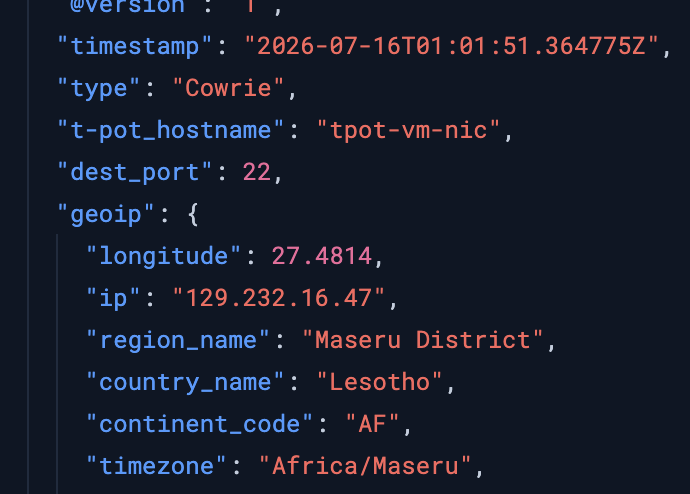
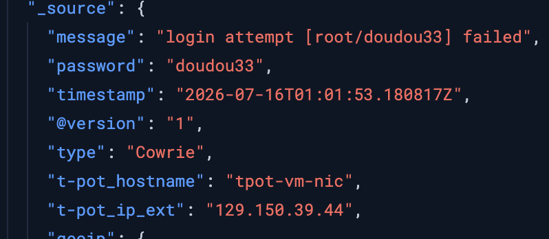
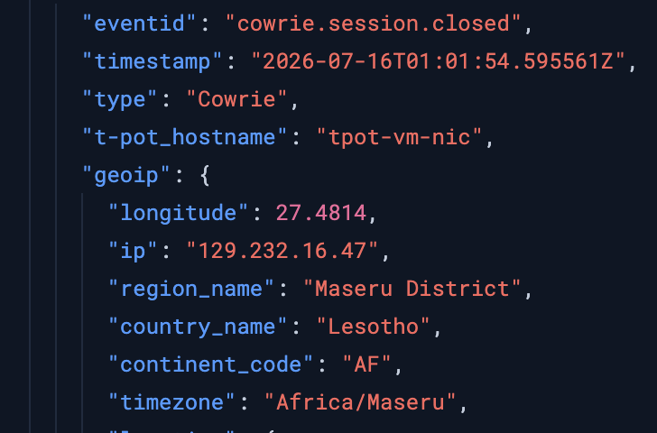
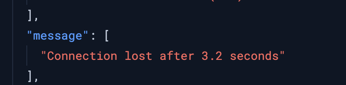

## Threat Hunting Activity

After 24 hours of the TPOT being active, thousands of attacks received, I have worked on the logs starting with the IP with the top hit. The attacker based in Lesotho had 483 hits using a single IP.

Timestamp of Triage:  2026-07-16 09:01:51.364 UTC+8
Severity Rating: Low (Mass-Scanner Activity / Defended)
Attack Vector: Botnet Credential Stuffing via SSH

* ** 1. Threat Actor Profile **
* Source IP:  129.232.16.47
* Geo Location: Maseru, Lesotho
* ISP: Econet Telecom Lesotho (PTY) LTD
* 

* ** 2. Chain of Events & IOCs **
*1. 2026-07–16 09:01:51.364 UTC+8 : A connection was attempted by the attacker with IP Address 129.232.16.47 via SSH (MITRE ATT&CK T1595.002).
*2. 2026-07–16 09:01:53.180 UTC+8 : The node executed a login attempt in the same session with username: ‘root’ & password: ‘doudou33’ (MITRE ATT&CK T1110.001).
* 
*3. 2026-07–16 09:01:54.595 UTC+8: Session was terminated after the failed login attempt by the attacker.
* 

* **3. Technical Analysis**
*Threat actor behavior matches signature with botnet scanners attempting dictionary attacks on open endpoints. The attack session (95fe9a3f1b82) lasted for only 3.2 seconds and proceeded to create more attempts using different session IDs.
* 

## 🛡️ Remediation & Defensive Hardening
* 1. System Hardening - Only whitelisted device will be allowed for system administration.
* 2. Password Policies - Ensure that no common and default passwords are enforced on endpoints. MFA is also recommended to implemented across all system endpoints.
* 3. Rate Limiting - Implement tools that blocks IP addresses that match known bot signatures.
* 4. Block Attacker IP - IP address 129.232.16.47 has been blocked in the ubuntu server.
* 
